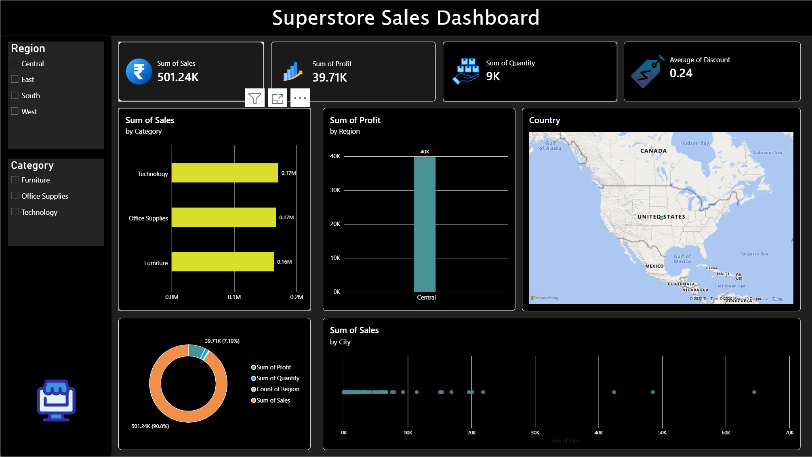

# 🛒 Superstore Sales Dashboard

An interactive **Power BI** dashboard built on the classic *Sample Superstore* dataset, providing a full view of sales, profit, quantity, and discount performance across regions, categories, and cities.



---
## 🎥 Demo Video

📥 **Download or watch the demo:**

[▶️ Dashboard Demo Video](./dashboard.mp4)

🎥 Demo Video

Watch the dashboard walkthrough on Google Drive:

🎬 ▶️ https://drive.google.com/file/d/1mDEQPItmjHIlzOBy9iRwBg-FDYga-FLe/view?usp=sharing
Note: Make sure your Google Drive video sharing setting is "Anyone with the link can view" so visitors can access it without requesting permission.

---

## 📊 Overview

This report answers key business questions for a retail superstore:

- Which **category** and **sub-category** drive the most sales and profit?
- How does performance vary across **regions** (Central, East, South, West)?
- Which **cities** and **countries** contribute the highest sales volume?
- What is the relationship between **discount** levels and **profitability**?
- How do **sales, profit, and quantity** trend together?

## ✨ Dashboard Features

| Visual | Description |
|---|---|
| **KPI Cards** | Sum of Sales, Sum of Profit, Sum of Quantity, Average Discount |
| **Sales by Category** | Horizontal bar chart comparing Furniture, Office Supplies, and Technology |
| **Profit by Region** | Column chart of profit contribution per region |
| **Country Map** | Geographic distribution of orders |
| **Sales vs. Profit Donut** | Composition breakdown of key measures |
| **Sales by City** | Scatter plot highlighting top-performing cities |
| **Slicers** | Filter by Region and Category |

## 🗂️ Files in this Project

```
├── Superstore_Sales.pbix        # Power BI report file
├── Sample_-_Superstore.csv      # Source dataset
├── dashboard-preview.png        # Dashboard screenshot
└── README.md                    # Project documentation
```

## 📁 Dataset

The dataset (`Sample_-_Superstore.csv`) contains ~9,994 retail order records with the following key fields:

| Column | Description |
|---|---|
| Order ID / Date / Ship Date | Order tracking info |
| Customer Name / Segment | Customer details |
| Region / State / City / Country | Geography |
| Category / Sub-Category / Product Name | Product hierarchy |
| Sales / Quantity / Discount / Profit | Core metrics |

## 🛠️ Tools Used

- **Power BI Desktop** — data modeling, DAX measures, and report design
- **CSV / Excel** — raw source data

## 🚀 How to Use

1. Clone or download this repository.
2. Open `Superstore_Sales.pbix` in **Power BI Desktop** (free download from Microsoft).
3. If prompted, update the data source path to point to `Sample_-_Superstore.csv` on your machine.
4. Use the **Region** and **Category** slicers on the left to filter the report.
5. Hover over any chart for tooltips, or click a data point to cross-filter the whole page.

## 📈 Key Insights

- Sales are fairly balanced across **Technology, Office Supplies, and Furniture**, each contributing close to a third of total sales.
- The **Central region** stands out in the Profit by Region view.
- A small number of **cities** generate a disproportionately large share of total sales (visible as outliers in the scatter plot).
- Average discount sits around **24%**, which is worth investigating against the profit trend.

## 📄 License

This project uses the publicly available **Sample Superstore** dataset for educational and portfolio purposes.

---

*Built with ❤️ using Power BI.*
