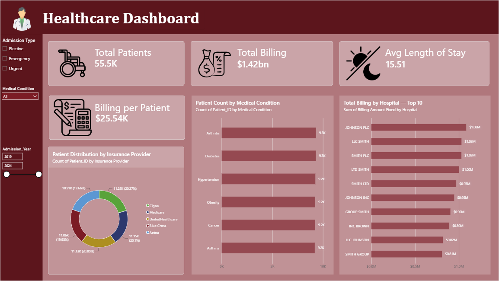
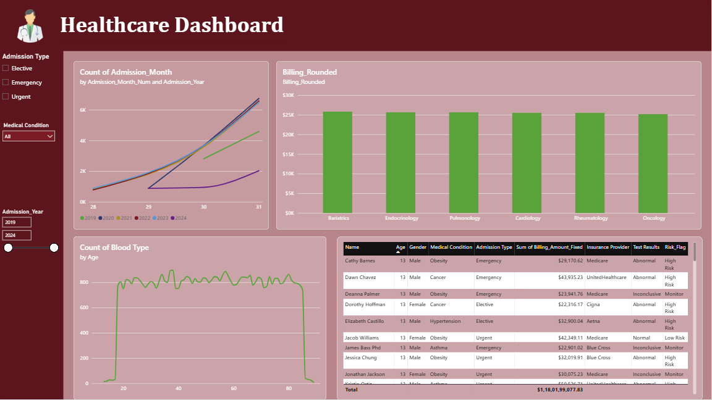
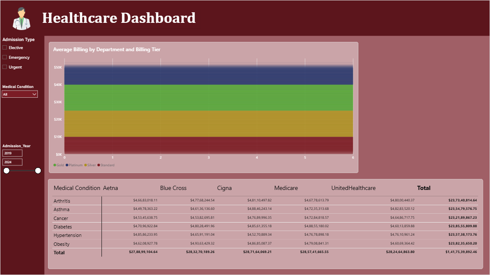

# 🏥 Healthcare Dashboard — Power BI

An interactive **Healthcare Analytics Dashboard** created in Microsoft Power BI to analyze patient information, healthcare billing, hospitals, insurance providers, medical conditions, admissions, and patient-level details.

---

## 📸 Dashboard Preview

🎥 Demo Video

Watch the dashboard walkthrough on Google Drive:

🎬 https://drive.google.com/file/d/1Os7BYdRf4PCRyqKaL08wyFZm6sAtCK-O/view?usp=sharing
---

### 🏠 Healthcare Dashboard — Overview



The overview page contains KPI cards, patient distribution, medical-condition analysis, hospital billing, and interactive slicers.

### 👤 Patient Detail



The Patient Detail page provides patient-level information including age, gender, medical condition, admission type, billing, insurance provider, test results, and risk flag.

### 💰 Billing Analysis



The Billing Analysis page focuses on admission trends, department billing, and billing comparisons by medical condition and insurance provider.

---

## 📊 Project Overview

The dashboard provides insights into:

- 👥 Total Patients
- 💰 Total Billing
- 🏥 Average Length of Stay
- 💵 Billing per Patient
- 🩺 Patient Count by Medical Condition
- 🏢 Hospital Billing Performance
- 🛡️ Insurance Provider Distribution
- 📅 Monthly Admission Trends
- 🧾 Patient Details
- 💳 Billing Analysis
- 🚩 Patient Risk Information

---

## 🛠️ Tools & Technologies

- **Microsoft Power BI Desktop**
- **Power Query**
- **Power BI Data Model**
- **DAX / Power BI aggregations**
- **Healthcare CSV Dataset**

---

## 📁 Project Structure

```text
Healthcare-PowerBI/
│
├── Healthcare_PB.pbix
├── Database/
│   └── Healthcare Dataset
├── images/
│   ├── dashboard_overview.png
│   ├── patient_detail.png
│   └── billing_analysis.png
└── README.md
```

---

# 📄 Dashboard Pages

## 1️⃣ Healthcare Dashboard — Overview

The main dashboard provides a high-level summary of the healthcare dataset.

### KPI Cards

- **Total Patients:** approximately 55.5K
- **Total Billing:** approximately $1.42B
- **Average Length of Stay:** approximately 15.51 days
- **Billing per Patient:** approximately $25.54K

### Main Visuals

- Patient Count by Medical Condition
- Total Billing by Hospital — Top 10
- Patient Distribution by Insurance Provider

### Slicers

- Admission Type
  - Elective
  - Emergency
  - Urgent
- Medical Condition
- Admission Year

---

## 2️⃣ Patient Detail

The Patient Detail page is designed for patient-level analysis.

### Patient Table Fields

- Name
- Age
- Age Category
- Gender
- Medical Condition
- Department
- Admission Type
- Stay Category
- Length of Stay
- Billing Rounded
- Insurance Provider
- Test Results
- Risk Flag

### Filters

- Medical Condition
- Admission Type

---

## 3️⃣ Billing Analysis

The Billing Analysis page focuses on financial and admission analysis.

### Visuals

- Monthly Admissions by Admission Year and Month
- Average Billing by Department
- Billing Matrix by Medical Condition and Insurance Provider

### Filters

- Admission Type
- Medical Condition
- Admission Year

---

# 🧹 Data Preparation

The healthcare dataset was prepared using Power Query.

Main preparation activities include:

1. Importing the healthcare CSV dataset.
2. Checking column names and data types.
3. Checking missing or empty values.
4. Preparing numerical fields such as Age, Billing Amount, and Length of Stay.
5. Preparing categorical fields such as Age Category, Stay Category, and Billing Tier.
6. Preparing Admission Month and Admission Year fields.
7. Creating the Medical Condition → Department categorical lookup.
8. Creating summary queries for dashboard analysis.

---

# 📌 Summary Queries

### Condition Summary

Grouped by **Medical Condition**.

Includes:

- Patient Count
- Average Billing
- Average Length of Stay

### Hospital Summary

Grouped by **Hospital**.

Includes:

- Total Patients
- Total Revenue
- Average Billing

### Insurance Summary

Grouped by **Insurance Provider**.

Includes:

- Covered Patients
- Total Claims / Billing
- Average Claim / Billing

### Monthly Admissions

Grouped by:

- Admission Year
- Admission Month Number

Includes:

- Monthly Count
- Monthly Revenue

---

# 🔢 Main Metrics

### Total Patients

Count of patient records / Patient ID.

### Total Billing

Sum of `Billing_Amount_Fixed`.

### Average Billing

Average of `Billing_Amount_Fixed`.

### Average Length of Stay

Average of `Length_of_Stay_Days`.

### Billing per Patient

Total billing divided by patient count.

---

# 🎨 Dashboard Design

The report uses a consistent healthcare-themed design with:

- Dark red / maroon header
- Light pink dashboard panels
- White headings
- KPI cards
- Interactive slicers
- Bar charts
- Donut chart
- Matrix
- Patient detail table

---

# 🔍 Key Insights

The dashboard allows users to analyze:

- Patient volume
- Overall healthcare billing
- Average patient stay
- Department-level billing
- Medical-condition patient counts
- Hospital billing performance
- Insurance provider distribution
- Admission patterns
- Patient-level billing
- Test results and risk flags

---

# 🚀 How to Open

1. Install **Microsoft Power BI Desktop**.
2. Open `Healthcare_PB.pbix`.
3. If required, reconnect the report to the healthcare CSV dataset.
4. Select **Refresh**.
5. Use the slicers to explore the dashboard.
6. Navigate between the report pages.

---

# 📦 Main Deliverable

```text
Healthcare_PB.pbix
```

This Power BI file contains the report, visuals, filters, transformations, and dashboard pages.

---

## 👩‍💻 Project Type

**Healthcare Data Analytics & Business Intelligence Project**

Built with:

**Power BI + Power Query + Healthcare Dataset**

---

## ⭐ Conclusion

This project demonstrates how healthcare data can be transformed into an interactive Business Intelligence dashboard using Power BI.

It combines **data cleaning, transformation, aggregation, visualization, filtering, and dashboard design** to provide useful insights into patients, billing, hospitals, insurance, admissions, and patient risk.
