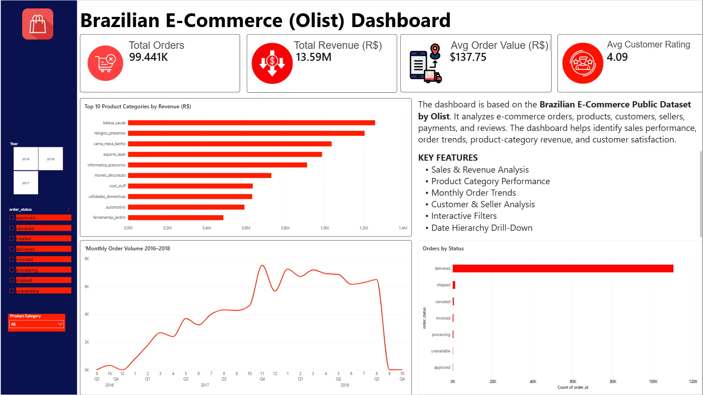
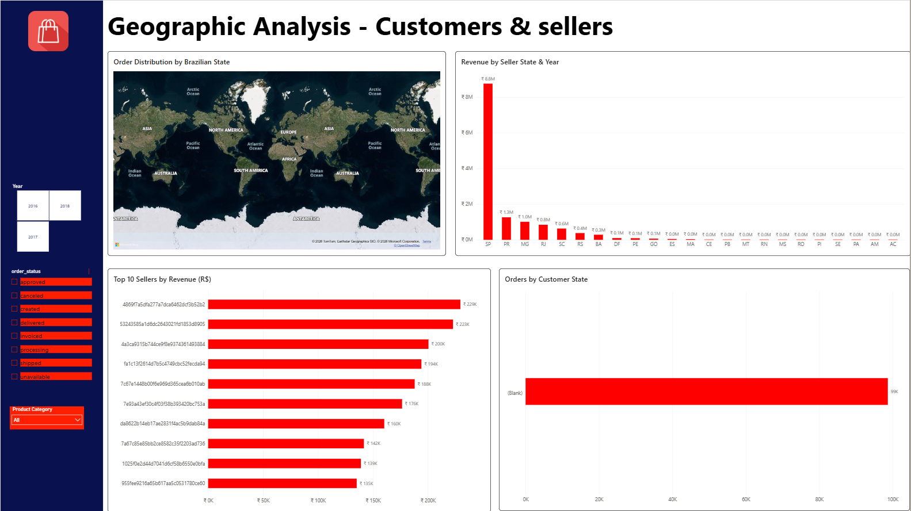
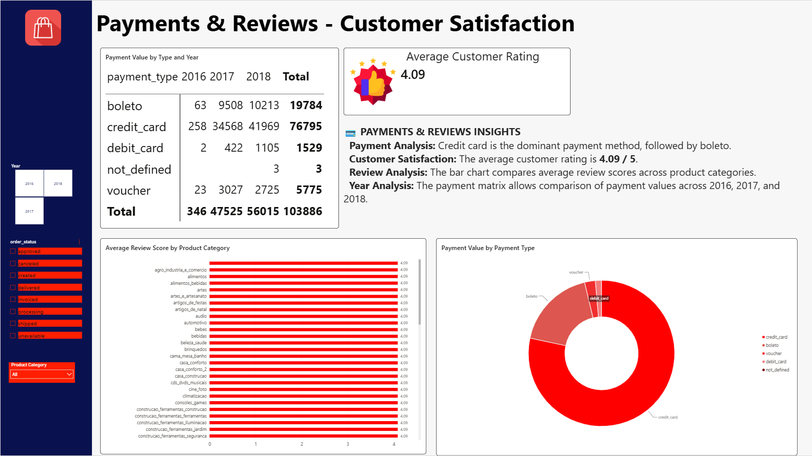

# Brazilian E-Commerce (Olist) — Power BI Dashboard

**Red & White Skill Education | Power BI — Practical Report 3 (PR 3) | Total Marks: 10**

---

## 📊 Project Overview

This project is an interactive Power BI dashboard built on the **Brazilian E-Commerce Public Dataset by Olist** (Kaggle). It analyzes e-commerce orders, products, customers, sellers, payments, and reviews to identify sales performance, order trends, product-category revenue, and customer satisfaction.

| Field | Detail |
|---|---|
| Institute | Red & White Skill Education |
| Subject | Power BI |
| Project | Practical Report 3 (PR 3) |
| Total Marks | 10 |
| Dataset | Brazilian E-Commerce Public Dataset by Olist (Kaggle) |
| Kaggle URL | https://www.kaggle.com/datasets/olistbr/brazilian-ecommerce |

---

## 🔑 Key Features

- Sales & Revenue Analysis
- Product Category Performance
- Monthly Order Trends
- Customer & Seller Analysis
- Interactive Filters (Year, Order Status, Product Category)
- Date Hierarchy Drill-Down

---

## 🖼️ Dashboard Preview

| Sales Overview | Geographic Analysis | Payments & Reviews |
|---|---|---|
|  |  |  |

---

## 🗂️ Dataset Structure — 9 CSV Files

The dataset contains 9 separate CSV files connected by primary and foreign keys — an ideal source for building a star schema in Power BI. Total columns: 54. Data note: real commercial data, anonymised — customer names replaced with Game of Thrones house names; all IDs are 32-character hash strings (UUID format).

| Table Name (Raw File) | Renamed In Model | Type | Rows | Key Columns |
|---|---|---|---|---|
| olist_orders_dataset.csv | DimOrders | Core Orders | 99,441 | order_id (PK), customer_id (FK), order_status, order_purchase_timestamp, order_approved_at, order_delivered_carrier_date, order_delivered_customer_date, order_estimated_delivery_date |
| olist_order_items_dataset.csv | FactOrderItems | Fact Table | 112,650 | order_id (FK), order_item_id, product_id (FK), seller_id (FK), shipping_limit_date, price, freight_value |
| olist_customers_dataset.csv | DimCustomers | Dim Customers | 99,441 | customer_id (PK), customer_unique_id, customer_zip_code_prefix, customer_city, customer_state |
| olist_products_dataset.csv | DimProducts | Dim Products | 32,951 | product_id (PK), product_category_name, product_name_length, product_description_length, product_photos_qty, product_weight_g, product_length_cm, product_height_cm, product_width_cm |
| olist_sellers_dataset.csv | DimSellers | Dim Sellers | 3,095 | seller_id (PK), seller_zip_code_prefix, seller_city, seller_state |
| olist_order_payments_dataset.csv | FactPayments | Fact Payments | 103,886 | order_id (FK), payment_sequential, payment_type, payment_installments, payment_value |
| olist_order_reviews_dataset.csv | FactReviews | Fact Reviews | 99,224 | review_id (PK), order_id (FK), review_score (1–5), review_comment_title, review_comment_message, review_creation_date, review_answer_timestamp |
| olist_geolocation_dataset.csv | DimGeolocation | Geo Lookup | 1,000,163 | geolocation_zip_code_prefix, geolocation_lat, geolocation_lng, geolocation_city, geolocation_state |
| product_category_name_translation.csv | (merged into DimProducts) | Category Lookup | 71 | product_category_name (FK), product_category_name_english |

**Note:** `product_category_name_translation.csv` is left-outer-joined into `olist_products_dataset` on `product_category_name`, exposing a new `Product_Category_EN` column, then disabled from load (CategoryTranslation).

---

## ⭐ Star Schema Design

**Fact Table:** `FactOrderItems` (from `olist_order_items`) sits at the centre. It contains measurable numeric facts (`price`, `freight_value`) and foreign keys (`order_id`, `product_id`, `seller_id`). One row per item sold, not one row per order.

**Dimension Tables:**
- `DimOrders` — order metadata & dates
- `DimCustomers` — customer location
- `DimProducts` — product metadata & category
- `DimSellers` — seller location
- `DimDate` — custom calendar table (built via Power Query M)

**Secondary Fact Tables (share DimOrders — Fact Constellation / Galaxy Schema):**
- `FactPayments` — payment values & type
- `FactReviews` — review scores & comments

`DimGeolocation` is used as a lookup table for geographic enrichment.

### Active Relationships (7) + 1 Inactive

| # | From → To | Cardinality | Cross-Filter | Active |
|---|---|---|---|---|
| 1 | FactOrderItems[order_id] → DimOrders[order_id] | Many to One (*:1) | Single | ✅ Active |
| 2 | FactOrderItems[product_id] → DimProducts[product_id] | Many to One (*:1) | Single | ✅ Active |
| 3 | FactOrderItems[seller_id] → DimSellers[seller_id] | Many to One (*:1) | Single | ✅ Active |
| 4 | DimOrders[customer_id] → DimCustomers[customer_id] | Many to One (*:1) | Single | ✅ Active (Snowflake role-playing dimension) |
| 5 | DimDate[Date] → DimOrders[order_purchase_timestamp] | One to Many (1:*) | Single | ✅ Active — primary date relationship |
| 6 | FactPayments[order_id] → DimOrders[order_id] | Many to One (*:1) | Single | ✅ Active |
| 7 | FactReviews[order_id] → DimOrders[order_id] | Many to One (*:1) | Single | ✅ Active |
| 8 | DimDate[Date] → DimOrders[order_delivered_customer_date] | — | Single | ⏸️ Inactive (use `USERELATIONSHIP()` in DAX to activate) |

### Star vs Snowflake

`FactOrderItems` sits at the centre, directly connected to `DimOrders`, `DimProducts`, `DimSellers`, `DimDate` — a **Star Schema**. The `DimOrders → DimCustomers` link is a two-level chain (`FactOrderItems → DimOrders → DimCustomers`), creating a **Snowflake extension**, because each order has one customer and customers are stored separately.

`FactPayments` and `FactReviews` both connecting independently to `DimOrders` forms a **Fact Constellation (Galaxy Schema)**.

### Bi-Directional Filter Risk

The `DimOrders ↔ DimCustomers` relationship's cross-filter direction was tested as **Both** to observe new filter paths (bi-directional filters can create ambiguous filter paths and lead to incorrect results), then reverted to **Single**.

---

## 📅 DimDate Calendar Table

Power BI has no built-in date dimension, so a calendar table was created manually via Power Query (Home → New Source → Blank Query → Advanced Editor) using M code, spanning `2016-01-01` to `2018-12-31`.

**Columns (6):** `Date`, `Year`, `Quarter`, `Month_Num`, `Month_Name`, `Weekday`, `Year_Quarter`

- Marked as **Date Table** (Table Tools → Mark as Date Table) using the `Date` column.
- `Month_Name` sorted by `Month_Num` so visuals display Jan–Dec instead of alphabetically.

---

## 🌲 Hierarchies (4)

| Hierarchy | Table | Levels | Enables |
|---|---|---|---|
| Date Hierarchy | DimDate | Year → Quarter → Month_Name | Drill-down from Year → Quarter → Month in all visuals |
| Product Hierarchy | DimProducts | Product_Category_EN → product_id | Drill-down from Category → individual Product |
| Seller Location (Geo Hierarchy) | DimSellers | seller_state → seller_city | Geographic drill-down for seller analysis |
| Customer Location (Geo Hierarchy) | DimCustomers | customer_state → customer_city | Geographic drill-down for customer analysis |

---

## 🧮 Measures & Formatting

- **Total Orders** — Card, `Count (Distinct)` of `DimOrders[order_id]` (implicit measure)
- **Total Revenue (R$)** — Card, `Sum` of `FactOrderItems[price]`, Currency format, 2 decimals
- **Avg Order Value (R$)** — Explicit DAX measure: `AVERAGEX(DimOrders, CALCULATE(SUM(FactOrderItems[price])))`
- **Avg Customer Rating** — Card, `Average` of `FactReviews[review_score]`, 1 decimal

**Formats applied:**
- `price` / `freight_value` / `payment_value` → Currency (R$), 2 decimal places
- `review_score` → Whole Number (0 decimals)
- `payment_installments` → Whole Number
- Geography categories set on `customer_city`, `customer_state`, `seller_city`, `seller_state` (City / State-or-Province) so map visuals plot correctly
- Titles bold, 12 pt, Charcoal `#4A4A4A`; primary bars Red `#CC0000`; data labels on top-10 bar charts

---

## 📈 Report Pages (3)

### Page 1 — Sales Overview
Header "Olist E-Commerce Analytics — Sales Overview" (bold, 18 pt, Red `#CC0000`) on a `#F5F5F5` canvas (16:9).

| Visual | Detail |
|---|---|
| KPI Cards (top row) | Total Orders: **99.441K** · Total Revenue: **R$13.59M** · Avg Order Value: **$137.75** · Avg Customer Rating: **4.09** |
| Top 10 Product Categories by Revenue (R$) | Clustered bar chart, `beleza_saude` leads at ~1.3M |
| Monthly Order Volume 2016–2018 | Line chart with drill-down (Date Hierarchy) |
| Orders by Status | Horizontal bar; `delivered` dominates (~100K+ orders) |
| 3 Slicers | Year (2016 / 2017 / 2018 tiles), Order Status (dropdown), Product Category (dropdown) |


### Page 2 — Geographic Analysis (Customers & Sellers)
Header "Geographic Distribution — Customers & Sellers".

| Visual | Detail |
|---|---|
| Order Distribution by Brazilian State | Map visual, size = Count of order_id (DimCustomers[customer_state]) |
| Revenue by Seller State & Year | Clustered column chart — SP dominates at ₹8.8M, followed by PR, MG, RJ, SC |
| Top 10 Sellers by Revenue (R$) | Horizontal bar chart of top seller IDs |
| Orders by Customer State | Horizontal bar chart |


### Page 3 — Payments & Reviews (Customer Satisfaction)
Header "Payment Methods — Customer Satisfaction".

| Visual | Detail |
|---|---|
| Payment Value by Type and Year | Matrix — Rows: payment_type, Columns: Year (2016/2017/2018), Values: Sum of payment_value, conditional formatting on values. Total across all types & years: **R$103,886** |
| Average Customer Rating | Card, **4.09 / 5** |
| Average Review Score by Product Category | Bar chart comparing average review scores across all categories |
| Payment Value by Payment Type | Donut chart — Credit Card is the dominant method, followed by Boleto |


**Payments summary (from Payment Value matrix):**

| Payment Type | 2016 | 2017 | 2018 | Total |
|---|---:|---:|---:|---:|
| Boleto | 63 | 9,508 | 10,213 | 19,784 |
| Credit Card | 258 | 34,568 | 41,969 | 76,795 |
| Debit Card | 2 | 422 | 1,105 | 1,529 |
| Not Defined | — | — | 3 | 3 |
| Voucher | 23 | 3,027 | 2,725 | 5,775 |
| **Total** | **346** | **47,525** | **56,015** | **103,886** |

**Consistent formatting across all 3 pages:** 16:9 canvas, `#F5F5F5` background, Red `#CC0000` header text box, grey `#6B7280` 11 pt sub-header, Snap to Grid enabled, all visuals aligned per page (Format → Align).

---

## 🎛️ Slicers, Filters & Interactivity

- **Year** slicer (tile style: 2016 / 2017 / 2018) filters all visuals by order year
- **Order Status** slicer (dropdown: delivered, shipped, canceled, invoiced, processing, unavailable, approved, created)
- **Product Category** slicer (dropdown, `Product_Category_EN`) filters all visuals by category
- **Drill-down** demonstrated on the Monthly Order Volume line chart via the Date Hierarchy (Year → Quarter → Month)
- **Filter flow**: selecting `health_beauty` in the Product Category slicer filters the Line Chart, Matrix, and KPI cards simultaneously — flowing `FactOrderItems → DimProducts` (Fact ← Dimension)
- **Report-level filter**: `order_status = delivered` applied so all pages default to showing only successfully completed orders

---

## 🛠️ Tools & Techniques Used

- Power BI Desktop — Get Data, Power Query Editor, Model View, Report View
- Power Query M — custom `DimDate` calendar table, merge/lookup for product category translation
- DAX — explicit measure (`AVERAGEX`), implicit aggregations (Sum, Count Distinct, Average)
- Data Modelling — Star Schema with Snowflake extension and Fact Constellation (multiple fact tables sharing dimensions)
- Data Categories — Geography (City / State-or-Province) for accurate map plotting
- Hierarchies — Date, Product, and two Geo hierarchies for drill-down analysis
- Built-in Theme — Accessible Default / Executive theme applied consistently across all 3 pages

---

## 📁 Repository Contents

```
├── PR3_Olist_Dashboard.pbix         # Power BI project file
├── screenshots/
│   ├── 01_sales_overview.png        # Page 1 — Sales Overview
│   ├── 02_geographic_analysis.png   # Page 2 — Geographic Analysis
│   └── 03_payments_reviews.png      # Page 3 — Payments & Reviews
├── README.md                        # This file
└── PR3_YourName_GRID.mp4 (or link)  # Recorded walkthrough video
```

---

## 🎥 Video Walkthrough

> [_\[(https://drive.google.com/file/d/1syJVo8a1fWotD86ZKHiYX0ylGaYHue98/view?usp=sharing)\]_]

The video (5–10 minutes) shows face (webcam) + Power BI screen simultaneously, explaining:
- What a Fact Table vs Dimension Table is
- Why DimDate is needed
- What the Star vs Snowflake schema means
- How filter flow works
- What Active vs Inactive relationships are
- What bi-directional filter risk means
- How drill-down works through the Date Hierarchy

---

## 📖 About the Dataset

The **Brazilian E-Commerce Public Dataset by Olist** contains real commercial order data from a Brazilian marketplace between 2016 and 2018. It covers orders, order items, products, customers, sellers, payments, reviews, and geolocation — connected via primary/foreign keys in a fully normalised (3NF) relational structure, making it ideal for building a Power BI star schema.

**Author:** Olist (olistbr) on Kaggle
**Source:** https://www.kaggle.com/datasets/olistbr/brazilian-ecommerce

---

*"Shaping Skills for Scaling Higher" — Red & White Skill Education*
