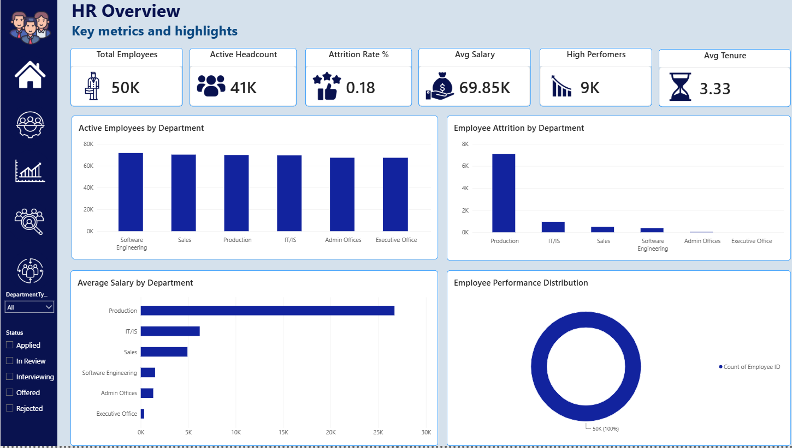
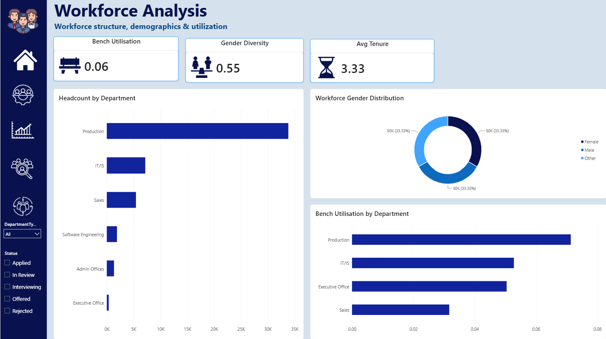
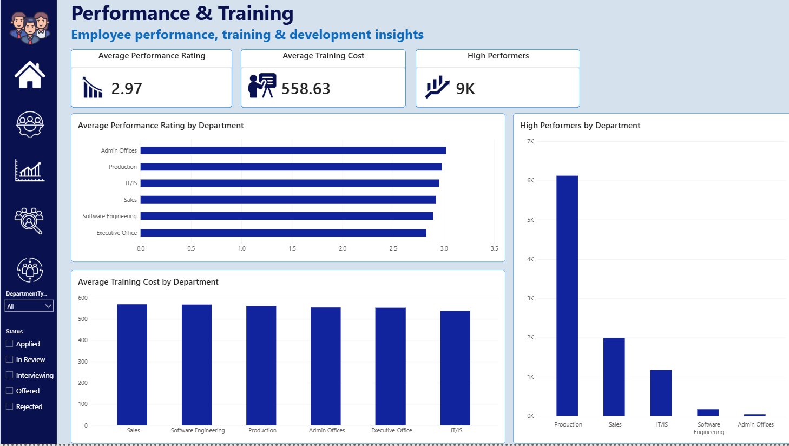
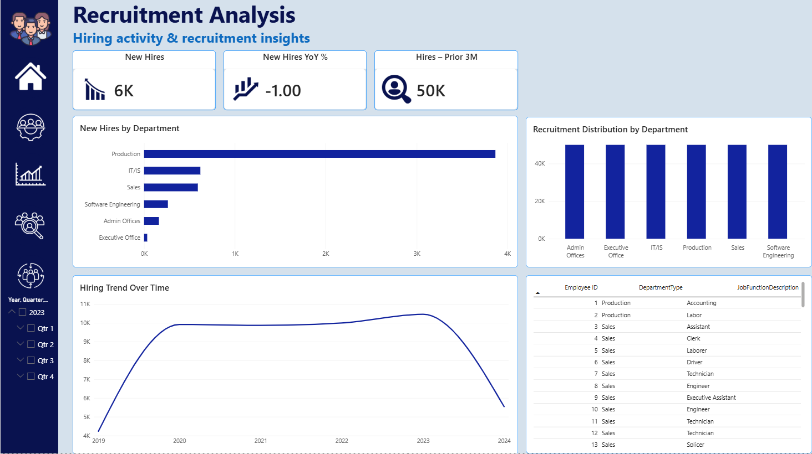
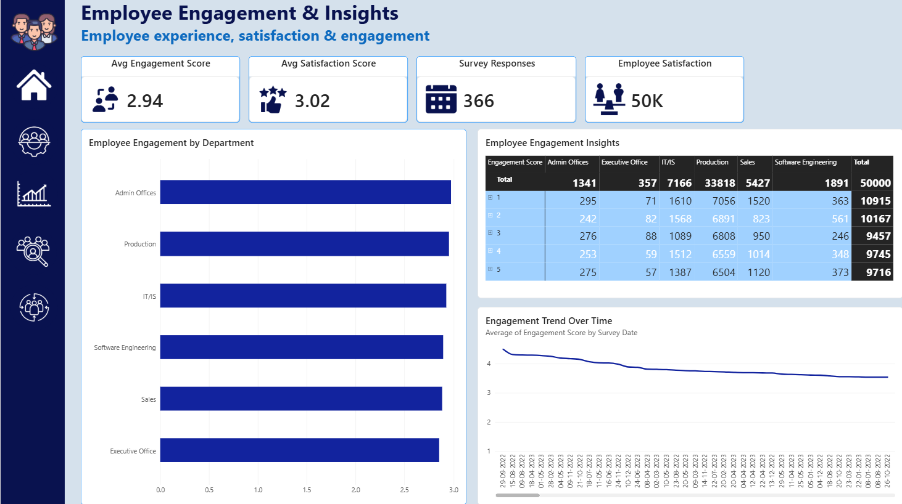

# HR Analytics Dashboard

## 📊 Project Overview

This project is an **HR Analytics Dashboard built in Microsoft Power BI** to provide a clear view of workforce structure, employee performance, recruitment activity, and employee engagement.

The dashboard is organized into **five interactive pages**, allowing users to move from a high-level HR overview to detailed workforce and employee insights.

## 🎯 Project Objectives

- Monitor overall employee headcount and active workforce.
- Analyze employee attrition across departments.
- Understand workforce demographics and utilization.
- Track employee performance and training metrics.
- Analyze recruitment and hiring activity.
- Understand employee engagement and satisfaction.
- Present HR information through interactive Power BI visuals and KPI cards.

## 📑 Dashboard Pages

### 1. HR Overview

Provides the main HR summary with key metrics and department-level analysis.

**Key areas:**
- Total Employees
- Active Headcount
- Attrition Rate
- Average Salary
- High Performers
- Average Tenure
- Active Employees by Department
- Employee Attrition by Department
- Average Salary by Department
- Employee Performance Distribution



---

### 2. Workforce Analysis

Focuses on workforce structure, demographics, and utilization.

**Key areas:**
- Bench Utilisation
- Gender Diversity
- Average Tenure
- Headcount by Department
- Workforce Gender Distribution
- Bench Utilisation by Department



---

### 3. Performance & Training

Analyzes employee performance and training-related metrics.

**Key areas:**
- Average Performance Rating
- Average Training Cost
- High Performers
- Average Performance Rating by Department
- Average Training Cost by Department
- High Performers by Department



---

### 4. Recruitment Analysis

Provides insights into hiring activity and recruitment trends.

**Key areas:**
- New Hires
- New Hires YoY %
- Hires – Prior 3M
- New Hires by Department
- Recruitment Distribution by Department
- Hiring Trend Over Time
- Employee-level recruitment details



---

### 5. Employee Engagement & Insights

Focuses on employee experience, engagement, and satisfaction.

**Key areas:**
- Average Engagement Score
- Average Satisfaction Score
- Survey Responses
- Employee Satisfaction
- Employee Engagement by Department
- Employee Engagement Insights
- Engagement Trend Over Time



## 🔍 Interactivity

The dashboard includes interactive Power BI functionality such as:

- Department filtering
- Status filtering
- Cross-filtering between visuals
- KPI cards
- Interactive charts and tables
- Navigation across dashboard pages

## 🛠️ Tools & Technologies

- **Microsoft Power BI**
- **DAX** for measures and calculations
- **Power Query** for data preparation and transformation
- **Data Modeling** for connecting HR-related tables
- Interactive visualizations and dashboard navigation

## 📈 Key Metrics Covered

| Metric | Purpose |
|---|---|
| Total Employees | Overall workforce size |
| Active Headcount | Current active workforce |
| Attrition Rate | Employee attrition measurement |
| Average Salary | Salary overview |
| High Performers | High-performing employee count |
| Average Tenure | Workforce experience indicator |
| Bench Utilisation | Workforce utilization |
| Gender Diversity | Workforce demographic view |
| Training Cost | Employee development investment |
| New Hires | Recruitment activity |
| Engagement Score | Employee engagement indicator |
| Satisfaction Score | Employee satisfaction indicator |

## 🚀 Project Flow

**HR Overview → Workforce Analysis → Performance & Training → Recruitment Analysis → Employee Engagement & Insights**

This flow provides a complete HR analytics journey from overall workforce KPIs to detailed employee experience insights.

## 💡 Conclusion

The HR Analytics Dashboard brings multiple HR areas into one interactive Power BI solution. It helps users quickly understand workforce size, department performance, attrition, recruitment, training, and employee engagement through a consistent dashboard experience.

## 📁 Project Structure

```text
HR_Dashboard/
│
├── README.md
├── images/
│   ├── hr_overview.png
│   ├── workforce_analysis.png
│   ├── performance_training.png
│   ├── recruitment_analysis.png
│   └── employee_engagement.png
│
└── HR_Dashboard.pbix
```

> **Note:** Keep the `images` folder in the same location as `README.md` so the screenshots display correctly on GitHub or another Markdown viewer.


## 🎥 Project Demo Video

Watch the complete **HR Analytics Power BI Dashboard** demonstration:

👉 [Watch the Project Demo Video on Google Drive](https://drive.google.com/file/d/1u2aGZiodmNhKTPNaXJBm-3VXXh4309mo/view?usp=sharing)

The video demonstrates the dashboard pages, navigation, KPIs, charts, filters, and HR insights.
