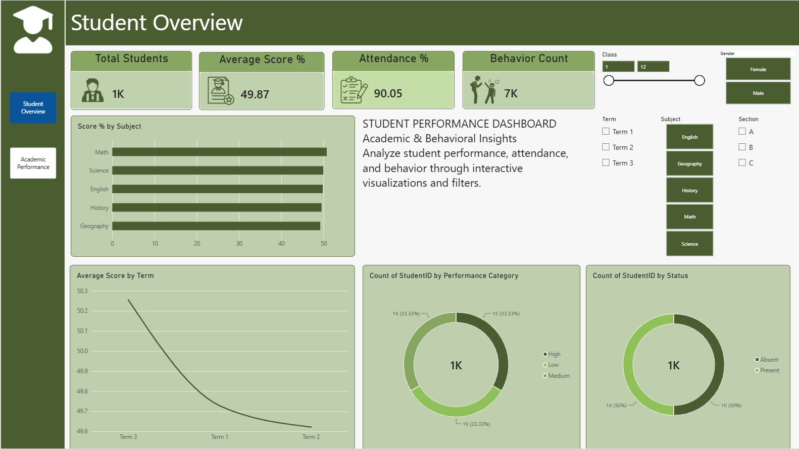
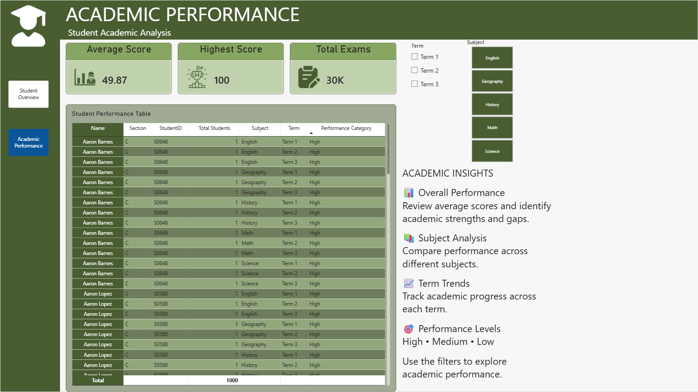
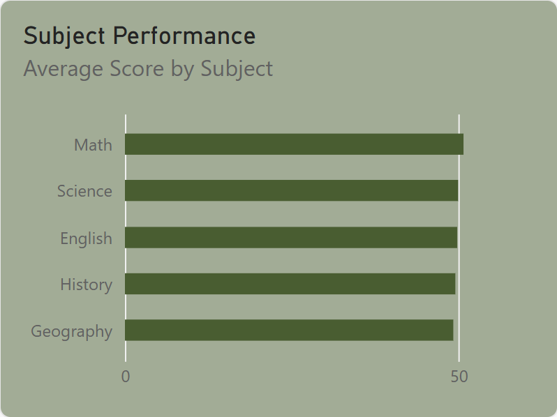

# Student Performance Dashboard

## 📊 Project Overview

The **Student Performance Dashboard** is an interactive Power BI project designed to analyze students' academic performance, attendance, and behavioral insights.

The dashboard provides an easy-to-understand view of student performance using KPI cards, charts, slicers, drillthrough, navigation buttons, and a report-page tooltip.

## 🎯 Objective

The main objective of this project is to build an interactive Power BI dashboard that helps users:

- Analyze student academic performance
- Compare average scores across subjects
- Track performance across academic terms
- Analyze attendance status
- Understand student performance categories
- Review individual student details
- Explore data using interactive filters

## 🗂️ Dataset

The project uses four main datasets:

- **Students** — Student ID, Name, Gender, Class, and Section
- **Scores** — Student ID, Subject, Exam Type, Score, MaxScore, and Term
- **Attendance** — Student ID, Date, and Status
- **Behavior** — Student ID, Date, Behavior Type, and Notes

## 🧮 DAX Measures and Calculations

### Total Students

```DAX
Total Students =
DISTINCTCOUNT(Students[StudentID])
```

### Average Score

```DAX
Average Score =
AVERAGE(Scores[Score])
```

### Score Percentage

```DAX
Score % =
DIVIDE(
    SUM(Scores[Score]),
    SUM(Scores[MaxScore]),
    0
) * 100
```

### Attendance Percentage

```DAX
Attendance % =
DIVIDE(
    CALCULATE(
        COUNTROWS(Attendance),
        Attendance[Status] = "Present"
    ),
    COUNTROWS(Attendance),
    0
) * 100
```

### Behavior Count

```DAX
Behavior Count =
COUNTROWS(Behavior)
```

### Highest Score

```DAX
Highest Score =
MAX(Scores[Score])
```

### Lowest Score

```DAX
Lowest Score =
MIN(Scores[Score])
```

### Total Exams / Score Records

```DAX
Total Exams =
COUNTROWS(Scores)
```

### Performance Category

The score percentage is used to classify performance into High, Medium, and Low categories.

```DAX
Performance Category =
VAR ScorePercentage =
    DIVIDE(Scores[Score], Scores[MaxScore], 0) * 100
RETURN
    SWITCH(
        TRUE(),
        ScorePercentage >= 80, "High",
        ScorePercentage >= 60, "Medium",
        "Low"
    )
```

## 📑 Dashboard Pages

### 1. Student Overview

The Student Overview page provides a high-level summary of student performance.

**KPI Cards:**
- Total Students
- Average Score %
- Attendance %
- Behavior Count

**Visualizations:**
- Average Score by Subject
- Performance by Term
- Score Distribution
- Attendance Status

**Slicers:**
- Class
- Section
- Gender
- Subject
- Term

### 2. Academic Performance

The Academic Performance page focuses on detailed academic analysis.

**KPI Cards:**
- Average Score
- Highest Score
- Lowest Score
- Total Exams

**Visuals and elements:**
- Student Performance Table
- Academic Insights
- Subject analysis
- Term analysis
- Performance Category
- Subject and Term filters

### 3. Student Details

The Student Details page is designed for individual student analysis using Power BI drillthrough.

It can display:
- Student Name
- Student ID
- Class
- Section
- Average Score
- Attendance %
- Subject-wise performance
- Attendance status
- Behavior history

## 🔎 Interactivity

The dashboard includes:

- **Slicers** for Class, Section, Gender, Subject, and Term
- **Page navigation buttons** for moving between dashboard pages
- **Drillthrough** for individual student details
- **Reset button** using a bookmark to return filters to the default state
- **Report-page tooltip** for displaying additional information on hover

## 🎨 Dashboard Design

The dashboard uses a consistent green academic theme with:

- KPI cards
- Rounded visual containers
- Navigation buttons
- Interactive slicers
- Charts and tables
- Academic insight text panels

## 🛠️ Tools Used

- **Microsoft Power BI**
- **Power Query** for data cleaning and transformation
- **DAX** for calculated measures and columns
- **CSV datasets** as data sources

## 📌 Key Insights

The dashboard allows users to identify:

- Overall student performance
- Subject-wise score differences
- Term-wise performance trends
- High, Medium, and Low performance groups
- Present and Absent attendance records
- Individual student academic and behavioral information

## 📁 Deliverable

The main project deliverable is the Power BI `.pbix` file.

## 👩‍🎓 Project Type

**Academic / Student Practical Project — Power BI Data Analysis & Data Science**

---

## 📸 Dashboard Screenshots

### Student Overview



### Academic Performance



### Student Tooltip / Subject Performance


